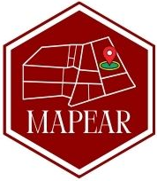

  
  
```{r setup, include=FALSE}
library(knitr)
library(rmdformats)

## Global options
knitr::opts_chunk$set(
	echo = FALSE,
	message = FALSE,
	warning = FALSE,
	comment = NA
)
```

```{r, echo=FALSE}

```
```{r}
# pacotes
library(leaflet)
library(dplyr)
```

<!--# seção-->
# BLOCO A
  
<!--# Sub-seção-->
## Térreo
  
  

<!--# Sub-seção-->
### Laboratório de Panificação &#127838;
  
<!--# mapa-->
```{r}
# Initialize and assign m as the leaflet object
utf <- leaflet() %>%
  # Now add tiles to it
  addTiles() %>%  
  # Setting the middle of where the map should be and the zoom level
  setView(lng=-51.114540, lat=-23.3075632, zoom = 40) %>%
  # Now, add a marker with a popup, 
  addMarkers(lng=-51.114540, lat=-23.3075632, 
             popup="<b>Laboratório de Panificação</b>
             <br><a href='fotos-A/terreo/lab_panif.jpg'>-lab001</a>")

utf 
```

  

### Laboratório de Bebidas e Vegetais &#129380;

```{r}
# Initialize and assign m as the leaflet object
utf <- leaflet() %>%
  # Now add tiles to it
  addTiles() %>%  
  # Setting the middle of where the map should be and the zoom level
  setView(lng=-51.114540, lat=-23.3075632, zoom = 40) %>%
  # Now, add a marker with a popup, 
  addMarkers(lng=-51.114540, lat=-23.3075632, 
             popup="<b>Laboratório de Bebidas e Vegetais</b>
             <br><a href='fotos-A/terreo/lab_bebidas_vegetais.jpg'>-lab002</a>")

utf 
```
  
### Laboratório de Laticíneos &#129472;
  
- Responsável: XXX XXXXX

<!--# mapa-->
```{r}
# Initialize and assign m as the leaflet object
utf <- leaflet() %>%
  # Now add tiles to it
  addTiles() %>%  
  # Setting the middle of where the map should be and the zoom level
  setView(lng=-51.114540, lat=-23.3075632, zoom = 40) %>%
  # Now, add a marker with a popup, 
  addMarkers(lng=-51.114540, lat=-23.3075632, 
             popup="<b>Laboratório de Laticíneos</b>
             <br><b>dldldldldl &#129371;</b><br><a href='fotos-A/terreo/lab_lat.jpg'>-lab003</a><br><a href='http://www.utfpr.edu.br/'>-UTFPR</a>")

utf 
```


### Laboratório de Carnes &#129385;

```{r}
# Initialize and assign m as the leaflet object
utf <- leaflet() %>%
  # Now add tiles to it
  addTiles() %>%  
  # Setting the middle of where the map should be and the zoom level
  setView(lng=-51.114540, lat=-23.3075632, zoom = 40) %>%
  # Now, add a marker with a popup, 
  addMarkers(lng=-51.114540, lat=-23.3075632, 
             popup="<b>Laboratório de Carnes</b>
             <br><a href='fotos-A/terreo/lab_carnes.jpg'>-lab004</a>")

utf 
```


## 1°andar

### DIRPPG

- Diretoria de pesquisa e pós-graduação

```{r}
# Initialize and assign m as the leaflet object
utf <- leaflet() %>%
  # Now add tiles to it
  addTiles() %>%  
  # Setting the middle of where the map should be and the zoom level
  setView(lng=-51.114540, lat=-23.3075632, zoom = 40) %>%
  # Now, add a marker with a popup, 
  addMarkers(lng=-51.114540, lat=-23.3075632, 
             popup="<b>DIRPPG</b>
             <br><a href='fotos-A/primeiro/dirppg.jpg'>-Sala101</a>")

utf 
```

### Salas de aula

-Salas número-102,103,104,105,106.

```{r}
# Initialize and assign m as the leaflet object
utf <- leaflet() %>%
  # Now add tiles to it
  addTiles() %>%  
  # Setting the middle of where the map should be and the zoom level
  setView(lng=-51.114540, lat=-23.3075632, zoom = 40) %>%
  # Now, add a marker with a popup, 
  addMarkers(lng=-51.114540, lat=-23.3075632, 
             popup="<b>Salas</b>
             <br><a href='fotos-A/primeiro/salas_aula.jpg'>-Salas</a>")

utf 
```


## 2°andar


### Data center


```{r}
# Initialize and assign m as the leaflet object
utf <- leaflet() %>%
  # Now add tiles to it
  addTiles() %>%  
  # Setting the middle of where the map should be and the zoom level
  setView(lng=-51.114540, lat=-23.3075632, zoom = 40) %>%
  # Now, add a marker with a popup, 
  addMarkers(lng=-51.114540, lat=-23.3075632, 
             popup="<b>Data center</b>
             <br><a href='fotos-A/segundo/Data Center.jpg'>-Sala202</a>")

utf 
```

### COGERH

-Cordenadoria de Gestão de Recursos Humanos 

```{r}
# Initialize and assign m as the leaflet object
utf <- leaflet() %>%
  # Now add tiles to it
  addTiles() %>%  
  # Setting the middle of where the map should be and the zoom level
  setView(lng=-51.114540, lat=-23.3075632, zoom = 40) %>%
  # Now, add a marker with a popup, 
  addMarkers(lng=-51.114540, lat=-23.3075632, 
             popup="<b>COGERH</b>
             <br><a href='fotos-A/segundo/COGERH.jpg'>-Sala204</a>")

utf 
```


### COGETI

```{r}
# Initialize and assign m as the leaflet object
utf <- leaflet() %>%
  # Now add tiles to it
  addTiles() %>%  
  # Setting the middle of where the map should be and the zoom level
  setView(lng=-51.114540, lat=-23.3075632, zoom = 40) %>%
  # Now, add a marker with a popup, 
  addMarkers(lng=-51.114540, lat=-23.3075632, 
             popup="<b>COGETI</b>
             <br><a href='fotos-A/segundo/COGETI.jpg'>-Sala20?</a>")

utf 
```


### DESEG

```{r}
# Initialize and assign m as the leaflet object
utf <- leaflet() %>%
  # Now add tiles to it
  addTiles() %>%  
  # Setting the middle of where the map should be and the zoom level
  setView(lng=-51.114540, lat=-23.3075632, zoom = 40) %>%
  # Now, add a marker with a popup, 
  addMarkers(lng=-51.114540, lat=-23.3075632, 
             popup="<b>DESEG</b>
             <br><a href='fotos-A/segundo/DESEG.jpg'>-Sala20?</a>")

utf 
```


### DIRPLAD, DEMAP, DEOFI e DEPRO


```{r}
# Initialize and assign m as the leaflet object
utf <- leaflet() %>%
  # Now add tiles to it
  addTiles() %>%  
  # Setting the middle of where the map should be and the zoom level
  setView(lng=-51.114540, lat=-23.3075632, zoom = 40) %>%
  # Now, add a marker with a popup, 
  addMarkers(lng=-51.114540, lat=-23.3075632, 
             popup="<b>DIRPLAD, DEMAP, DEOFI e DEPRO</b>
             <br><a href='fotos-A/segundo/DIRPLAD_DEMAP_DEOFI_DEPRO.jpg'>-Sala206</a>")

utf 
```


### Fragmentadora de papel


```{r}
# Initialize and assign m as the leaflet object
utf <- leaflet() %>%
  # Now add tiles to it
  addTiles() %>%  
  # Setting the middle of where the map should be and the zoom level
  setView(lng=-51.114540, lat=-23.3075632, zoom = 40) %>%
  # Now, add a marker with a popup, 
  addMarkers(lng=-51.114540, lat=-23.3075632, 
             popup="<b>Fragmentadora de papel</b>
             <br><a href='fotos-A/segundo/frag-papel.jpg'>-Sala20?</a>")

utf 
```


### FUNTEF


```{r}
# Initialize and assign m as the leaflet object
utf <- leaflet() %>%
  # Now add tiles to it
  addTiles() %>%  
  # Setting the middle of where the map should be and the zoom level
  setView(lng=-51.114540, lat=-23.3075632, zoom = 40) %>%
  # Now, add a marker with a popup, 
  addMarkers(lng=-51.114540, lat=-23.3075632, 
             popup="<b>FUNTEF</b>
             <br><a href='fotos-A/segundo/FUNTEF.jpg'>-Sala205</a>")

utf 
```


### GADIR e DIRGE


```{r}
# Initialize and assign m as the leaflet object
utf <- leaflet() %>%
  # Now add tiles to it
  addTiles() %>%  
  # Setting the middle of where the map should be and the zoom level
  setView(lng=-51.114540, lat=-23.3075632, zoom = 40) %>%
  # Now, add a marker with a popup, 
  addMarkers(lng=-51.114540, lat=-23.3075632, 
             popup="<b>GADIR e DIRGE</b>
             <br><a href='fotos-A/segundo/GADIR_DIRGE.jpg'>-Sala209</a>")

utf 
```


### PPGTAL


```{r}
# Initialize and assign m as the leaflet object
utf <- leaflet() %>%
  # Now add tiles to it
  addTiles() %>%  
  # Setting the middle of where the map should be and the zoom level
  setView(lng=-51.114540, lat=-23.3075632, zoom = 40) %>%
  # Now, add a marker with a popup, 
  addMarkers(lng=-51.114540, lat=-23.3075632, 
             popup="<b>PPGATL</b>
             <br><a href='fotos-A/segundo/PPGTAL.jpg'>-Sala201</a>")

utf 
```


### Sala de reuniões


```{r}
# Initialize and assign m as the leaflet object
utf <- leaflet() %>%
  # Now add tiles to it
  addTiles() %>%  
  # Setting the middle of where the map should be and the zoom level
  setView(lng=-51.114540, lat=-23.3075632, zoom = 40) %>%
  # Now, add a marker with a popup, 
  addMarkers(lng=-51.114540, lat=-23.3075632, 
             popup="<b>Sala de reuniões</b>
             <br><a href='fotos-A/segundo/Sala_reunioes.jpg'>-Sala208</a>")

utf 
```


## 3° andar

### Sala de apoio

```{r}
# Initialize and assign m as the leaflet object
utf <- leaflet() %>%
  # Now add tiles to it
  addTiles() %>%  
  # Setting the middle of where the map should be and the zoom level
  setView(lng=-51.114540, lat=-23.3075632, zoom = 40) %>%
  # Now, add a marker with a popup, 
  addMarkers(lng=-51.114540, lat=-23.3075632, 
             popup="<b>Sala de apoio</b>
             <br><a href='fotos-A/terceiro/sala_apoio_a301.jpg'>-Sala301</a>")

utf 
```


### Laboratório de biologia e ecologia


```{r}
# Initialize and assign m as the leaflet object
utf <- leaflet() %>%
  # Now add tiles to it
  addTiles() %>%  
  # Setting the middle of where the map should be and the zoom level
  setView(lng=-51.114540, lat=-23.3075632, zoom = 40) %>%
  # Now, add a marker with a popup, 
  addMarkers(lng=-51.114540, lat=-23.3075632, 
             popup="<b>Laboratório de biologia e ecologia</b>
             <br><a href='fotos-A/terceiro/lab_biologia_ecologia.jpg'>-Sala308</a>")

utf 
```


### Laboratório de bioquimica

```{r}
# Initialize and assign m as the leaflet object
utf <- leaflet() %>%
  # Now add tiles to it
  addTiles() %>%  
  # Setting the middle of where the map should be and the zoom level
  setView(lng=-51.114540, lat=-23.3075632, zoom = 40) %>%
  # Now, add a marker with a popup, 
  addMarkers(lng=-51.114540, lat=-23.3075632, 
             popup="<b>Laboratório de bioquimica</b>
             <br><a href='fotos-A/terceiro/lab_biioquimica.jpg'>-Sala306</a>")

utf 
```


### Laboratório de metódos intrumentais


```{r}
# Initialize and assign m as the leaflet object
utf <- leaflet() %>%
  # Now add tiles to it
  addTiles() %>%  
  # Setting the middle of where the map should be and the zoom level
  setView(lng=-51.114540, lat=-23.3075632, zoom = 40) %>%
  # Now, add a marker with a popup, 
  addMarkers(lng=-51.114540, lat=-23.3075632, 
             popup="<b>Laboratório de métodos instrumentais</b>
             <br><a href='fotos-A/terceiro/lab_met_instrumentais.jpg'>-Sala304</a>")

utf 
```


### Laboratório de microbiologia

```{r}
# Initialize and assign m as the leaflet object
utf <- leaflet() %>%
  # Now add tiles to it
  addTiles() %>%  
  # Setting the middle of where the map should be and the zoom level
  setView(lng=-51.114540, lat=-23.3075632, zoom = 40) %>%
  # Now, add a marker with a popup, 
  addMarkers(lng=-51.114540, lat=-23.3075632, 
             popup="<b>Laboratório de microbiologia</b>
             <br><a href='fotos-A/terceiro/lab_microbiologia.jpg'>-Sala305</a>")

utf 
```


### Laboratório de análise sesorial
 
```{r}
# Initialize and assign m as the leaflet object
utf <- leaflet() %>%
  # Now add tiles to it
  addTiles() %>%  
  # Setting the middle of where the map should be and the zoom level
  setView(lng=-51.114540, lat=-23.3075632, zoom = 40) %>%
  # Now, add a marker with a popup, 
  addMarkers(lng=-51.114540, lat=-23.3075632, 
             popup="<b>Laboratório de análise sensorial</b>
             <br><a href='fotos-A/terceiro/lab_analise_sensorial.jpg'>-Sala302</a>")

utf 
```


<!--# seção-->
# BLOCO B

## Térreo

### Laboratório de polimeros

```{r}
# Initialize and assign m as the leaflet object
utf <- leaflet() %>%
  # Now add tiles to it
  addTiles() %>%  
  # Setting the middle of where the map should be and the zoom level
  setView(lng=-51.1147880, lat=-23.3074732, zoom = 40) %>%
  # Now, add a marker with a popup, 
  addMarkers(lng=-51.1147880, lat=-23.3074732, 
             popup="<b>Laboratório de polimeros</b>
             <br><a href='fotos-B/terreo/lab_polimeros.jpg'>-Sala001</a>")

utf 
```

### Laboratório de ensaios

```{r}
# Initialize and assign m as the leaflet object
utf <- leaflet() %>%
  # Now add tiles to it
  addTiles() %>%  
  # Setting the middle of where the map should be and the zoom level
  setView(lng=-51.1147880, lat=-23.3074732, zoom = 40) %>%
  # Now, add a marker with a popup, 
  addMarkers(lng=-51.1147880, lat=-23.3074732, 
             popup="<b>Laboratório de ensaios</b>
             <br><a href='fotos-B/terreo/lab_polimeros.jpg'>-Sala006</a>")

utf 
```


### Laboratório de cerâmica

```{r}
# Initialize and assign m as the leaflet object
utf <- leaflet() %>%
  # Now add tiles to it
  addTiles() %>%  
  # Setting the middle of where the map should be and the zoom level
  setView(lng=-51.1147880, lat=-23.3074732, zoom = 40) %>%
  # Now, add a marker with a popup, 
  addMarkers(lng=-51.1147880, lat=-23.3074732, 
             popup="<b>Laboratório de cerâmica</b>
             <br><a href='fotos-B/terreo/lab_ceramica.jpg'>-Sala002</a>")

utf 
```


### Laboratório de análise de materiais

```{r}
# Initialize and assign m as the leaflet object
utf <- leaflet() %>%
  # Now add tiles to it
  addTiles() %>%  
  # Setting the middle of where the map should be and the zoom level
  setView(lng=-51.1147880, lat=-23.3074732, zoom = 40) %>%
  # Now, add a marker with a popup, 
  addMarkers(lng=-51.1147880, lat=-23.3074732, 
             popup="<b>Laboratório de análise de materiais</b>
             <br><a href='fotos-B/terreo/lab_analise.jpg'>-Sala004</a>")

utf 
```

### Laboratório de apoio

```{r}
# Initialize and assign m as the leaflet object
utf <- leaflet() %>%
  # Now add tiles to it
  addTiles() %>%  
  # Setting the middle of where the map should be and the zoom level
  setView(lng=-51.1147880, lat=-23.3074732, zoom = 40) %>%
  # Now, add a marker with a popup, 
  addMarkers(lng=-51.1147880, lat=-23.3074732, 
             popup="<b>Laboratório de apoio</b>
             <br><a href='fotos-B/terreo/lab_apoio.jpg'>-Sala003</a>")

utf 
```


### Laboratório de metais

```{r}
# Initialize and assign m as the leaflet object
utf <- leaflet() %>%
  # Now add tiles to it
  addTiles() %>%  
  # Setting the middle of where the map should be and the zoom level
  setView(lng=-51.1147880, lat=-23.3074732, zoom = 40) %>%
  # Now, add a marker with a popup, 
  addMarkers(lng=-51.1147880, lat=-23.3074732, 
             popup="<b>Laboratório de metais</b>
             <br><a href='fotos-B/terreo/lab_metais.jpg'>-Sala005</a>")

utf 
```


## 1° andar 

### Auditório 

```{r}
# Initialize and assign m as the leaflet object
utf <- leaflet() %>%
  # Now add tiles to it
  addTiles() %>%  
  # Setting the middle of where the map should be and the zoom level
  setView(lng=-51.1147880, lat=-23.3074732, zoom = 40) %>%
  # Now, add a marker with a popup, 
  addMarkers(lng=-51.1147880, lat=-23.3074732, 
             popup="<b>Auditório</b>
             <br><a href='fotos-B/primeiro/auditorio.jpg'>-Sala101</a>")

utf 
```

### Sala de professores

```{r}
# Initialize and assign m as the leaflet object
utf <- leaflet() %>%
  # Now add tiles to it
  addTiles() %>%  
  # Setting the middle of where the map should be and the zoom level
  setView(lng=-51.1147880, lat=-23.3074732, zoom = 40) %>%
  # Now, add a marker with a popup, 
  addMarkers(lng=-51.1147880, lat=-23.3074732, 
             popup="<b>Sala de professores</b>
             <br><a href='fotos-B/primeiro/sala_prof_b1.jpg'>-Sala105</a>")

utf 
```

### Cordenação, DIRGRAD e SEGEA

```{r}
# Initialize and assign m as the leaflet object
utf <- leaflet() %>%
  # Now add tiles to it
  addTiles() %>%  
  # Setting the middle of where the map should be and the zoom level
  setView(lng=-51.1147880, lat=-23.3074732, zoom = 40) %>%
  # Now, add a marker with a popup, 
  addMarkers(lng=-51.1147880, lat=-23.3074732, 
             popup="<b>Cordenação, DIRGRAD e SEGEA</b>
             <br><a href='fotos-B/primeiro/cord_dirgrad_segea.jpg'>-Sala102</a>")

utf 
```

### DEPED, NAI e NUENS

```{r}
# Initialize and assign m as the leaflet object
utf <- leaflet() %>%
  # Now add tiles to it
  addTiles() %>%  
  # Setting the middle of where the map should be and the zoom level
  setView(lng=-51.1147880, lat=-23.3074732, zoom = 40) %>%
  # Now, add a marker with a popup, 
  addMarkers(lng=-51.1147880, lat=-23.3074732, 
             popup="<b>DEPED, NAI e NEUENS</b>
             <br><a href='fotos-B/primeiro/deped_nai_nuens.jpg'>-Sala106</a>")

utf 
```

### Secretaria Acadêmica

```{r}
# Initialize and assign m as the leaflet object
utf <- leaflet() %>%
  # Now add tiles to it
  addTiles() %>%  
  # Setting the middle of where the map should be and the zoom level
  setView(lng=-51.1147880, lat=-23.3074732, zoom = 40) %>%
  # Now, add a marker with a popup, 
  addMarkers(lng=-51.1147880, lat=-23.3074732, 
             popup="<b>DERAC</b>
             <br><a href='fotos-B/primeiro/derac.jpg'>-Sala104</a>")

utf 
```

## 2° andar

### Salas de aula 

```{r}
# Initialize and assign m as the leaflet object
utf <- leaflet() %>%
  # Now add tiles to it
  addTiles() %>%  
  # Setting the middle of where the map should be and the zoom level
  setView(lng=-51.1147880, lat=-23.3074732, zoom = 40) %>%
  # Now, add a marker with a popup, 
  addMarkers(lng=-51.1147880, lat=-23.3074732, 
             popup="<b>Salas de aula</b>
             <br><a href='fotos-B/segundo/salas_aula_b.jpg'>-Sala20?</a>")

utf 
```

## 3° andar

### Laboratório de tecnologia de conversão de energia

```{r}
# Initialize and assign m as the leaflet object
utf <- leaflet() %>%
  # Now add tiles to it
  addTiles() %>%  
  # Setting the middle of where the map should be and the zoom level
  setView(lng=-51.1147880, lat=-23.3074732, zoom = 40) %>%
  # Now, add a marker with a popup, 
  addMarkers(lng=-51.1147880, lat=-23.3074732, 
             popup="<b>Laboratório de tecnologiade conversão de energia</b>
             <br><a href='fotos-B/terceiro/lab_tecnologia_b.jpg'>-Sala301</a>")

utf 
```

### Laboratório de química 

```{r}
# Initialize and assign m as the leaflet object
utf <- leaflet() %>%
  # Now add tiles to it
  addTiles() %>%  
  # Setting the middle of where the map should be and the zoom level
  setView(lng=-51.1147880, lat=-23.3074732, zoom = 40) %>%
  # Now, add a marker with a popup, 
  addMarkers(lng=-51.1147880, lat=-23.3074732, 
             popup="<b>Laboratório de química</b>
             <br><a href='fotos-B/terceiro/lab_qui_b302.jpg'>-Sala302</a>")

utf 
```

### Laboratório de química

```{r}
# Initialize and assign m as the leaflet object
utf <- leaflet() %>%
  # Now add tiles to it
  addTiles() %>%  
  # Setting the middle of where the map should be and the zoom level
  setView(lng=-51.1147880, lat=-23.3074732, zoom = 40) %>%
  # Now, add a marker with a popup, 
  addMarkers(lng=-51.1147880, lat=-23.3074732, 
             popup="<b>Laboratório de química</b>
             <br><a href='fotos-B/terceiro/lab_qui_5_b.jpg'>-Sala304</a>")

utf 
```

### Laboratório de química

```{r}
# Initialize and assign m as the leaflet object
utf <- leaflet() %>%
  # Now add tiles to it
  addTiles() %>%  
  # Setting the middle of where the map should be and the zoom level
  setView(lng=-51.1147880, lat=-23.3074732, zoom = 40) %>%
  # Now, add a marker with a popup, 
  addMarkers(lng=-51.1147880, lat=-23.3074732, 
             popup="<b>Laboratório de química</b>
             <br><a href='fotos-B/terceiro/lab_qui_4_b.jpg'>-Sala303</a>")

utf 
```


<!--# seção-->
# BLOCO F

### Laboratório de reagentes químicos e Almoxarifado

```{r}
# Initialize and assign m as the leaflet object
utf <- leaflet() %>%
  # Now add tiles to it
  addTiles() %>%  
  # Setting the middle of where the map should be and the zoom level
  setView(lng=-51.114540, lat=-23.3075632, zoom = 40) %>%
  # Now, add a marker with a popup, 
  addMarkers(lng=-51.114540, lat=-23.3075632, 
             popup="<b>Laboratório de reagentes químicos e almoxarifado</b>
             <br><a href='fotos-F/reagentes_almoxarifado.jpg'>-Salas 001 e 002</a>")

utf 
```

### Depósito de materiais e Patrimônio

```{r}
# Initialize and assign m as the leaflet object
utf <- leaflet() %>%
  # Now add tiles to it
  addTiles() %>%  
  # Setting the middle of where the map should be and the zoom level
  setView(lng=-51.114540, lat=-23.3075632, zoom = 40) %>%
  # Now, add a marker with a popup, 
  addMarkers(lng=-51.114540, lat=-23.3075632, 
             popup="<b>Depósito de materiais e Patrimônio</b>
             <br><a href='fotos-F/deposito_patrimonio.jpg'>-Salas 003 e 004</a>")

utf 
```

<!--# seção-->
# BLOCO S

## Térreo 

### Laboratório de Saneamento

```{r}
# Initialize and assign m as the leaflet object
utf <- leaflet() %>%
  # Now add tiles to it
  addTiles() %>%  
  # Setting the middle of where the map should be and the zoom level
  setView(lng=-51.114540, lat=-23.3075632, zoom = 40) %>%
  # Now, add a marker with a popup, 
  addMarkers(lng=-51.114540, lat=-23.3075632, 
             popup="<b>Laboraório de Saneamento</b>
             <br><a href='fotos-F/lab-saneamento.jpg'>-Sala004</a>")

utf 
```

## 1° andar

### PPGEA

```{r}
# Initialize and assign m as the leaflet object
utf <- leaflet() %>%
  # Now add tiles to it
  addTiles() %>%  
  # Setting the middle of where the map should be and the zoom level
  setView(lng=-51.114540, lat=-23.3075632, zoom = 40) %>%
  # Now, add a marker with a popup, 
  addMarkers(lng=-51.114540, lat=-23.3075632, 
             popup="<b>PPGEA</b>
             <br><a href='fotos-S/ppgea-s.jpg'>-Sala101</a>")

utf 
```


<!--# seção-->

# BLOCO L

### Sinochem

```{r}
# Initialize and assign m as the leaflet object
utf <- leaflet() %>%
  # Now add tiles to it
  addTiles() %>%  
  # Setting the middle of where the map should be and the zoom level
  setView(lng=-51.114540, lat=-23.3075632, zoom = 40) %>%
  # Now, add a marker with a popup, 
  addMarkers(lng=-51.114540, lat=-23.3075632, 
             popup="<b>Sala de pesquisa</b>
             <br><a href='fotos-L/sinochem.jpg'>-Sala 016</a>")

utf 
```

### Gorilada

```{r}
# Initialize and assign m as the leaflet object
utf <- leaflet() %>%
  # Now add tiles to it
  addTiles() %>%  
  # Setting the middle of where the map should be and the zoom level
  setView(lng=-51.114540, lat=-23.3075632, zoom = 40) %>%
  # Now, add a marker with a popup, 
  addMarkers(lng=-51.114540, lat=-23.3075632, 
             popup="<b>Atlética</b>
             <br><a href='fotos-L/atletica.jpg'>-Sala 027</a>")

utf 
```

### ATM SPHER

```{r}
# Initialize and assign m as the leaflet object
utf <- leaflet() %>%
  # Now add tiles to it
  addTiles() %>%  
  # Setting the middle of where the map should be and the zoom level
  setView(lng=-51.114540, lat=-23.3075632, zoom = 40) %>%
  # Now, add a marker with a popup, 
  addMarkers(lng=-51.114540, lat=-23.3075632, 
             popup="<b>Sala de pesquisa</b>
             <br><a href='fotos-L/atm-spher.jpg'>-Sala 005</a>")

utf 
```

### baja

```{r}
# Initialize and assign m as the leaflet object
utf <- leaflet() %>%
  # Now add tiles to it
  addTiles() %>%  
  # Setting the middle of where the map should be and the zoom level
  setView(lng=-51.114540, lat=-23.3075632, zoom = 40) %>%
  # Now, add a marker with a popup, 
  addMarkers(lng=-51.114540, lat=-23.3075632, 
             popup="<b>Sala de pesquisa</b>
             <br><a href='fotos-L/baja.jpg'>-Sala 02?</a>")

utf 
```

### DCE, CAENQ e CAAN

```{r}
# Initialize and assign m as the leaflet object
utf <- leaflet() %>%
  # Now add tiles to it
  addTiles() %>%  
  # Setting the middle of where the map should be and the zoom level
  setView(lng=-51.114540, lat=-23.3075632, zoom = 40) %>%
  # Now, add a marker with a popup, 
  addMarkers(lng=-51.114540, lat=-23.3075632, 
             popup="<b>Centros Acadêmicos</b>
             <br><a href='fotos-L/eq-amb-dce.jpg'>-Sala 0??</a>")

utf 
```

### IAPAR

```{r}
# Initialize and assign m as the leaflet object
utf <- leaflet() %>%
  # Now add tiles to it
  addTiles() %>%  
  # Setting the middle of where the map should be and the zoom level
  setView(lng=-51.114540, lat=-23.3075632, zoom = 40) %>%
  # Now, add a marker with a popup, 
  addMarkers(lng=-51.114540, lat=-23.3075632, 
             popup="<b>Sala de pesquisa</b>
             <br><a href='fotos-L/iapar.jpg'>-Sala 0??</a>")

utf 
```

### LAMA

```{r}
# Initialize and assign m as the leaflet object
utf <- leaflet() %>%
  # Now add tiles to it
  addTiles() %>%  
  # Setting the middle of where the map should be and the zoom level
  setView(lng=-51.114540, lat=-23.3075632, zoom = 40) %>%
  # Now, add a marker with a popup, 
  addMarkers(lng=-51.114540, lat=-23.3075632, 
             popup="<b>Sala de pesquisa</b>
             <br><a href='fotos-L/lama.jpg'>-Sala 006</a>")

utf 
```

### LAMBA

```{r}
# Initialize and assign m as the leaflet object
utf <- leaflet() %>%
  # Now add tiles to it
  addTiles() %>%  
  # Setting the middle of where the map should be and the zoom level
  setView(lng=-51.114540, lat=-23.3075632, zoom = 40) %>%
  # Now, add a marker with a popup, 
  addMarkers(lng=-51.114540, lat=-23.3075632, 
             popup="<b>Sala de pesquisa</b>
             <br><a href='fotos-L/lamba.jpg'>-Sala 003</a>")

utf 
```

### LASSPROD

```{r}
# Initialize and assign m as the leaflet object
utf <- leaflet() %>%
  # Now add tiles to it
  addTiles() %>%  
  # Setting the middle of where the map should be and the zoom level
  setView(lng=-51.114540, lat=-23.3075632, zoom = 40) %>%
  # Now, add a marker with a popup, 
  addMarkers(lng=-51.114540, lat=-23.3075632, 
             popup="<b>Sala de pesquisa</b>
             <br><a href='fotos-L/lassprod.jpg'>-Sala 0??</a>")

utf 
```

### CAMEC e CAEMA

```{r}
# Initialize and assign m as the leaflet object
utf <- leaflet() %>%
  # Now add tiles to it
  addTiles() %>%  
  # Setting the middle of where the map should be and the zoom level
  setView(lng=-51.114540, lat=-23.3075632, zoom = 40) %>%
  # Now, add a marker with a popup, 
  addMarkers(lng=-51.114540, lat=-23.3075632, 
             popup="<b>Centros Acadêmicos</b>
             <br><a href='fotos-L/mec-mate.jpg'>-Sala 025</a>")

utf 
```

### PET

```{r}
# Initialize and assign m as the leaflet object
utf <- leaflet() %>%
  # Now add tiles to it
  addTiles() %>%  
  # Setting the middle of where the map should be and the zoom level
  setView(lng=-51.114540, lat=-23.3075632, zoom = 40) %>%
  # Now, add a marker with a popup, 
  addMarkers(lng=-51.114540, lat=-23.3075632, 
             popup="<b>Sala de pesquisa</b>
             <br><a href='fotos-L/pet.jpg'>-Sala 024</a>")

utf 
```

### Sala de pesquisa

```{r}
# Initialize and assign m as the leaflet object
utf <- leaflet() %>%
  # Now add tiles to it
  addTiles() %>%  
  # Setting the middle of where the map should be and the zoom level
  setView(lng=-51.114540, lat=-23.3075632, zoom = 40) %>%
  # Now, add a marker with a popup, 
  addMarkers(lng=-51.114540, lat=-23.3075632, 
             popup="<b>Sala de pesquisa</b>
             <br><a href='fotos-L/pesquisa08.jpg'>-Sala 008</a>")

utf 
```

### PPGCEM

```{r}
# Initialize and assign m as the leaflet object
utf <- leaflet() %>%
  # Now add tiles to it
  addTiles() %>%  
  # Setting the middle of where the map should be and the zoom level
  setView(lng=-51.114540, lat=-23.3075632, zoom = 40) %>%
  # Now, add a marker with a popup, 
  addMarkers(lng=-51.114540, lat=-23.3075632, 
             popup="<b>Sala de pesquisa</b>
             <br><a href='fotos-L/ppgcem.jpg'>-Sala 0??</a>")

utf 
```